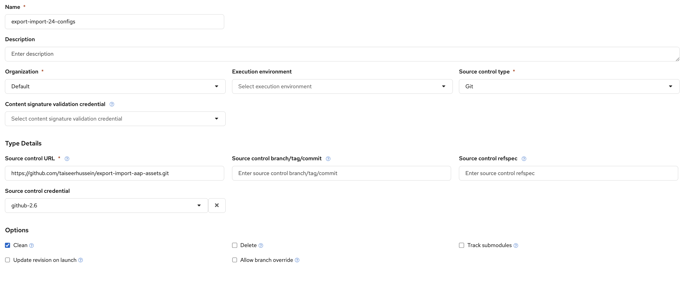
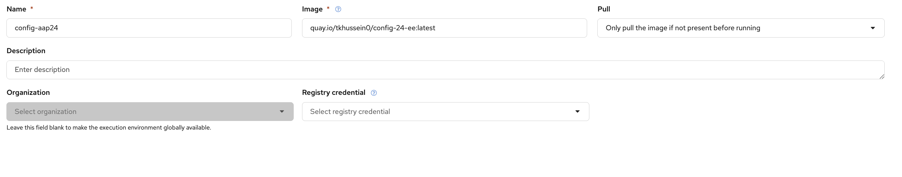
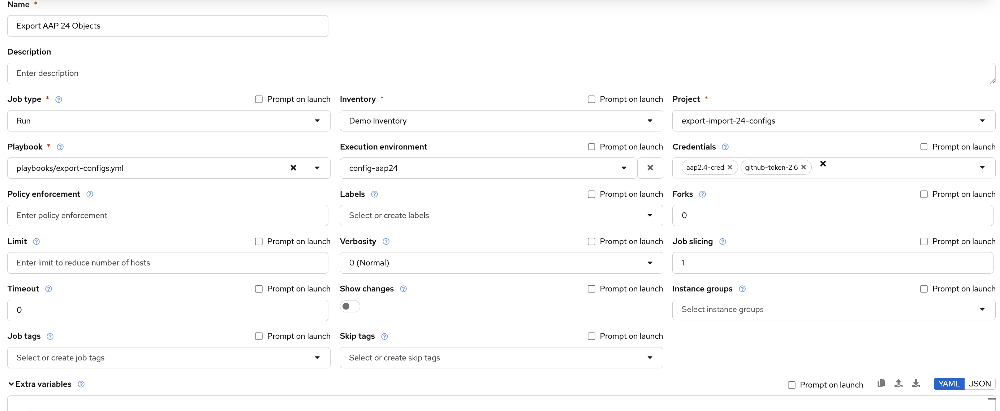
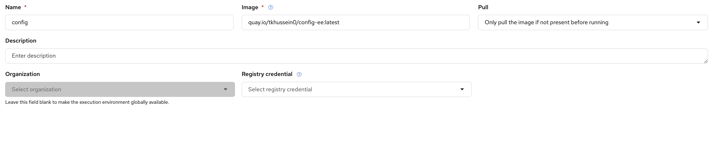
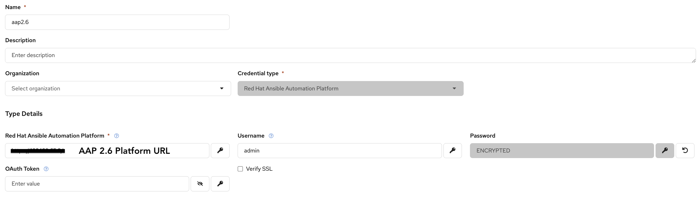
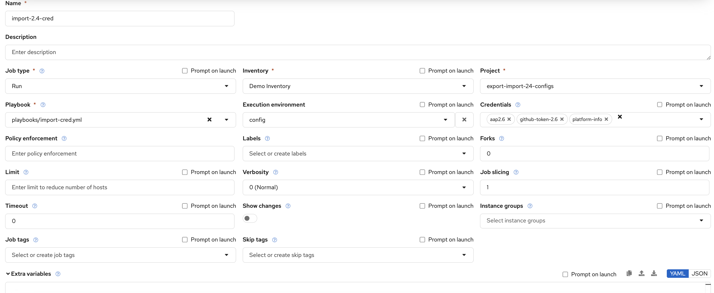
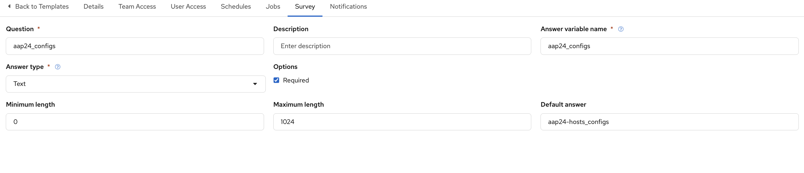

# Export and Import AAP Assets (AAP 2.4 → AAP 2.6)

## Overview

This repository provides a migration workflow for exporting configuration assets from **Ansible Automation Platform (AAP) 2.4** and importing them into **AAP 2.6**.

This is for those who decided not follow the supported path that was provided by Red Hat in this [doc] (https://docs.redhat.com/en/documentation/red_hat_ansible_automation_platform/2.6/)upgrade-ref_upgrade_scenarios_rpm#upgrade-scenarios-rpm___rpm_based_ansible_automation_platform_2_4_on_rhel_8. Those who decided to stand a greenfiiled installation of 2.6 parallel to AAP 2.4. Hence the repo will simple use some of the comunity collectios to export the assesst then import them to AAP 2.6. 

All playbooks in this repository are intended to be executed from an **AAP 2.6 environment**. The export process connects remotely to the source AAP 2.4 Controller, exports its configuration, normalizes the exported data, and prepares it for import into AAP 2.6.

The migration workflow consists of the following stages:

1. Export assets from AAP 2.4
2. Import credential types and credentials into AAP 2.6
3. Manually update credential secrets in AAP 2.6
4. Import the remaining assets into AAP 2.6

---

## Migration Path

This repository has been developed and tested for the following migration path:

| Source  | Target  |
| ------- | ------- |
| AAP 2.4 | AAP 2.6 |

Other source or target versions may require modifications to the playbooks and are not currently validated.

---

## Migration Workflow

```text
AAP 2.6
    │
    ├── Run export-configs.yml
    │
    ▼
AAP 2.4 Controller
    │
    ├── Export configuration
    │
    ▼
Git Repository
    │
    ├── Review exported assets
    │
    ▼
AAP 2.6
    ├── Run import-cred.yml
    ├── Update credential secrets
    └── Run import-confige.yml
```

> **Important:** These playbooks are designed to run from an AAP 2.6 environment. The source AAP 2.4 instance is accessed remotely through the Controller API.

---

## Prerequisites

### Source Environment (AAP 2.4)

* AAP 2.4 Controller URL
* Controller administrator credentials
* Ability to create temporary API tokens

### Target Environment (AAP 2.6)

* AAP 2.6 Gateway/Controller URL
* Platform administrator credentials

### Git Repository

The export process stores the exported assets in a Git repository.

Requirements:

* GitHub Personal Access Token (PAT)
* Permission to clone, commit, and push changes

---

## Execution Environments

This migration workflow uses two separate Execution Environments (EEs). The resaon we have two seprate EEs is to overcome any conflict of the collection versions that are required for each segment. 

The repo includes the definitions of each EE under ee directory. You can use them to create the EEs images. You need to update the ansible.cfg file to add your Red Hat hub token. The token can be generated here 

### Export Execution Environment

The Export EE is used by `export-configs.yml` to:

* Connect to the source AAP 2.4 Controller
* Generate a temporary API token
* Export assets
* Normalize exported data
* Commit and push exported assets to Git

### Import Execution Environment

The Import EE is used by:

* `import-cred.yml`
* `import-confige.yml`

### Example Execution Environment Definition

```yaml
---
version: 3

images:
  base_image:
    name: registry.redhat.io/ansible-automation-platform-26/ee-supported-rhel9:latest

dependencies:
  galaxy: requirements.yml
```

### Playbook to EE Mapping

| Playbook           | Execution Environment |
| ------------------ | --------------------- |
| export-configs.yml | Export EE             |
| import-cred.yml    | Import EE             |
| import-confige.yml | Import EE             |

---

## Repository Structure

```text
.
├── playbooks
│   ├── export-configs.yml
│   ├── import-cred.yml
│   └── import-confige.yml
├── roles
├── var_files
│   └── platform-info.yml
├── ansible.cfg
└── README.md
```

---

# Step 1 - Export Assets from AAP 2.4

The export playbook performs the following tasks:

* Connects to the source AAP 2.4 Controller
* Creates a temporary Controller API token
* Exports AAP assets
* Normalizes exported data
* Converts assets into a Configuration-as-Code structure
* Commits and pushes exported assets to the configured Git repository

Follow the following steps on AAP 2.6 to execute the export process
1. Create Red Hat Automation platform cred as shown in the image below: 

2. Create a project as shown in the following image

3. Create the export EE as shown in the following image. Please note that the image is the one you created for the export ee

4. Create the export job-template as show in the following image. The way we provid the github token is by creating a cred type for it. Feel free to use any other method. Just be carefull that it is encrypted and not shared. 

5. Update the survay for the job template as shown below. Please make sure that the Answer variable name matches exactly what is shown.
 
6. Once done lauch the job template. Upon successfull it will create a directory in your git repo with the AAP 2.4 assets that will be used during the import process. 

### Exported Assets

The export process captures assets such as:

* Organizations
* Teams
* Users
* Credential Types
* Credentials
* Inventories
* Hosts
* Groups
* Inventory Sources
* Projects
* Execution Environments
* Job Templates
* Workflow Job Templates
* Notification Templates
* Schedules
* Applications
* Roles and Permissions

> **Note:** Credential secret values are not exported.

---

# Step 2 - Import Credentials into AAP 2.6

Credentials should be imported before any other assets.


This playbook imports:
* Organizations
* Teams
* Users
* Credential Types
* Credentials

Follow the following steps to import the cred to your AAP 2.6
1. Create the import EE. Make sure you use the EE's image you created for the import part

2. Create Red Hat Automation Platfrom for the AAP 2.6 environment.

3. Create the job template to import the cred type as well as the cred. The playbook will import the orgs, users, and teams first since some of the cred and org specific.

4. Update the job template survey to include the source location of the assets, it should match the directory name you used in the export phase.

5. Launch the job template. 

At this stage, credential objects are created, but secret values remain empty.

---

# Step 3 - Update Credential Secrets

After importing credentials, manually update all required secrets through the AAP 2.6 UI or API.

Examples include:

* Passwords
* API Tokens
* Vault Passwords
* SSH Private Keys
* Cloud Provider Secrets
* Automation Hub Tokens

This step is required before importing the remaining assets.

Failure to update credential secrets may result in:

* Project synchronization failures
* Inventory source synchronization failures
* Job template failures
* Workflow execution failures

---

# Step 4 - Import Remaining Assets

After credential secrets have been updated, import the remaining configuration.

This playbook imports:

* Inventories
* Hosts
* Groups
* Inventory Sources
* Projects
* Execution Environments
* Job Templates
* Workflow Job Templates
* Notification Templates
* Schedules
* Applications
* Roles and Permissions

Follow the following steps to import the rest of the assets
1. Create a job template

2. Update the job template survey to include the source location of the assets, it should match the directory name you used in the export phase.

3. launch the job template
---

---

## Required Permissions

### Source AAP 2.4

The account used for export should have:

* System Administrator privileges
* Permission to create API tokens
* Read access to all assets being exported

### Target AAP 2.6

The account used for import should have:

* Platform Administrator privileges
* Permission to create and modify all platform resources

---

## Credential Handling

AAP does not export credential secrets.

As a result, the migration process:

1. Exports credential metadata only
2. Creates credential objects in AAP 2.6
3. Requires administrators to manually populate secret values
4. Imports dependent assets only after credentials are functional

This approach prevents sensitive information from being exported or stored in source control.

---

## Limitations

The following items are not automatically migrated:

* Credential secrets
* SSH private keys
* Vault passwords
* API tokens
* OAuth tokens
* Other encrypted credential fields

These values must be manually updated in AAP 2.6 after running the credential import playbook.

---

## Post-Migration Validation

After the migration is complete, verify:

* Projects synchronize successfully
* Inventory sources synchronize successfully
* Credentials contain valid secret values
* Job templates launch successfully
* Workflow job templates execute successfully
* Notifications function as expected
* Scheduled jobs are present and enabled

---

## Migration Validation Checklist

* [ ] Organizations imported successfully
* [ ] Teams imported successfully
* [ ] Users imported successfully
* [ ] Credentials imported successfully
* [ ] Credential secrets updated
* [ ] Projects synchronized successfully
* [ ] Inventory sources synchronized successfully
* [ ] Job templates launched successfully
* [ ] Workflow job templates launched successfully
* [ ] Notifications tested successfully
* [ ] Schedules reviewed and enabled


---

## Notes

* Review exported assets before importing into production.
* Test the migration in a non-production environment first.
* Environment-specific settings may require manual adjustments after import.
* Credential secrets must be manually updated before importing dependent assets.
* Some integrations may require endpoint or credential updates after migration.

---

## Disclaimer

This repository is intended to assist with migrating configuration assets from AAP 2.4 to AAP 2.6. Review all exported and imported content to ensure it aligns with your organization's security, compliance, and operational requirements before use in production.
