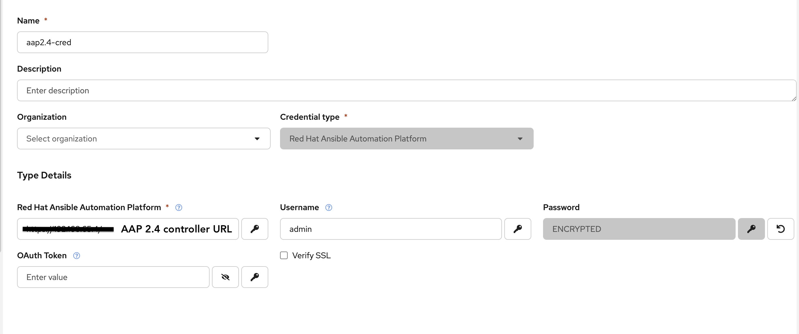
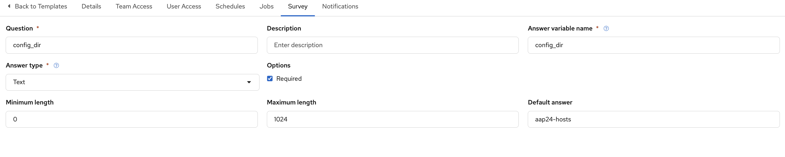
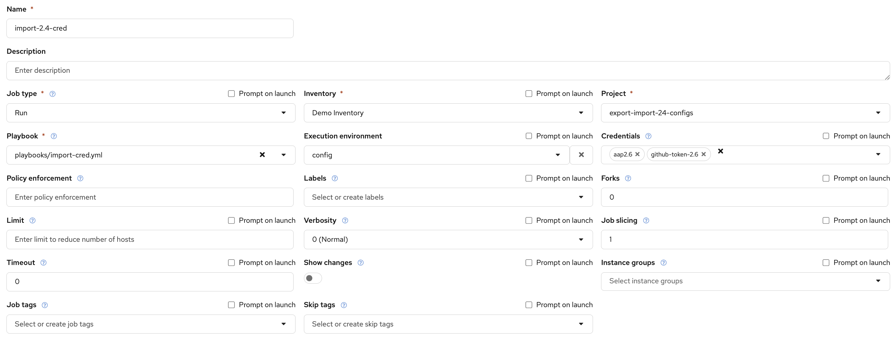
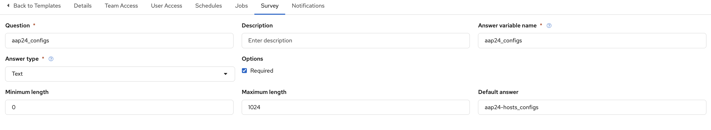

# Export and Import AAP Assets (AAP 2.4 → AAP 2.6)

## Overview

This repository provides a migration workflow for exporting configuration assets from **Red Hat Ansible Automation Platform (AAP) 2.4** and importing them into **AAP 2.6**.

This solution is intended for customers who choose not to follow the supported in-place upgrade path documented by Red Hat and instead deploy a new AAP 2.6 environment alongside an existing AAP 2.4 installation.

The workflow uses community-supported collections to export configuration assets from the source AAP 2.4 environment, normalize the exported data, and import it into the target AAP 2.6 environment.

All playbooks in this repository are designed to be executed as **Job Templates in AAP 2.6**. The export process connects remotely to the source AAP 2.4 Controller through the Controller API, exports the configuration, converts it into a Configuration-as-Code structure, and stores the results in a Git repository for import.

The migration workflow consists of four stages:

1. Export assets from AAP 2.4
2. Import credential types and credentials into AAP 2.6
3. Update credential secrets manually
4. Import the remaining assets into AAP 2.6

> **Important**
>
> All playbooks in this repository are intended to be executed as **Job Templates in AAP 2.6**.
>
> The export playbook communicates with the source AAP 2.4 Controller remotely through the Controller API. No playbooks are executed directly on the source AAP 2.4 environment.

---

## Migration Path

This repository has been developed and tested for the following migration path:

| Source | Target |
|---------|---------|
| AAP 2.4 | AAP 2.6 |

Other source or target versions may require modifications and are not currently validated.

---

## Migration Workflow

```text
AAP 2.6
    │
    ├── Run export-configs.yml
    │
    ▼
AAP 2.4 Controller
    │
    ├── Export configuration
    │
    ▼
Git Repository
    │
    ├── Review exported assets
    │
    ▼
AAP 2.6
    ├── Run import-cred.yml
    ├── Update credential secrets
    └── Run import-confige.yml
```

---

## Prerequisites

### Source Environment (AAP 2.4)

- AAP 2.4 Controller URL
- Controller administrator credentials
- Ability to create temporary API tokens

### Target Environment (AAP 2.6)

- AAP 2.6 Gateway/Controller URL
- Platform Administrator credentials

### Git Repository

The export process stores exported assets in a Git repository.

Requirements:

- GitHub Personal Access Token (PAT)
- Permission to clone, commit, and push changes

---

## Execution Environments

This migration workflow uses two separate Execution Environments (EEs).

Separate EEs are required because the export and import processes depend on different collection versions. Using dedicated EEs avoids dependency conflicts and ensures compatibility with both AAP 2.4 and AAP 2.6.

Execution Environment definitions are provided under the `ee/` directory.

Before building the images, update the `ansible.cfg` file with your Red Hat Automation Hub token.

### Export Execution Environment

The Export EE is used by `export-configs.yml` to:

- Connect to the source AAP 2.4 Controller
- Generate a temporary API token
- Export assets
- Normalize exported data
- Commit and push exported assets to Git

### Import Execution Environment

The Import EE is used by:

- `import-cred.yml`
- `import-confige.yml`

### Example Execution Environment Definition

```yaml
---
version: 3

images:
  base_image:
    name: registry.redhat.io/ansible-automation-platform-26/ee-supported-rhel9:latest

dependencies:
  galaxy: requirements.yml
```

### Playbook to EE Mapping

| Playbook | Execution Environment |
|-----------|----------------------|
| export-configs.yml | Export EE |
| import-cred.yml | Import EE |
| import-confige.yml | Import EE |

---

## Repository Structure

```text
.
├── ee
├── playbooks
│   ├── export-configs.yml
│   ├── import-cred.yml
│   └── import-confige.yml
├── roles
├── var_files
│   └── platform-info.yml
├── ansible.cfg
└── README.md
```

---

# Step 1 - Export Assets from AAP 2.4

The export playbook performs the following tasks:

- Connects to the source AAP 2.4 Controller
- Creates a temporary Controller API token
- Exports AAP assets
- Normalizes exported data
- Converts assets into a Configuration-as-Code structure
- Commits and pushes exported assets to the configured Git repository

## Export Setup

### 1. Create an AAP 2.4 Credential

Create a **Red Hat Ansible Automation Platform** credential that points to the source AAP 2.4 environment.



### 2. Create the Project

Create the project that contains this repository.


### 3. Create the Export Execution Environment

Create an Execution Environment using the Export EE image you built.


### 4. Create the Export Job Template

Create a Job Template using:

- Project: This repository
- Playbook: `export-configs.yml`
- Execution Environment: Export EE

The GitHub token is provided through a custom credential type in this example. Feel free to use another secure method.


### 5. Configure the Survey

Configure the survey exactly as shown below.

**Important:** Ensure that the Answer Variable Names match exactly.



### 6. Launch the Job Template

Upon successful completion, a new directory will be created in the configured Git repository containing the exported AAP 2.4 assets.

This directory will be used as the source for the import process.

---

## Exported Assets

The export process captures assets such as:

- Organizations
- Teams
- Users
- Credential Types
- Credentials
- Inventories
- Hosts
- Groups
- Inventory Sources
- Projects
- Execution Environments
- Job Templates
- Workflow Job Templates
- Notification Templates
- Schedules
- Applications
- Roles and Permissions

> **Note:** Credential secret values are not exported.

---

# Step 2 - Import Credentials into AAP 2.6

Credentials should be imported before any other assets.

This playbook imports:

- Organizations
- Teams
- Users
- Credential Types
- Credentials

## Credential Import Setup

### 1. Create the Import Execution Environment

Create an Execution Environment using the Import EE image.


### 2. Create an AAP 2.6 Credential

Create a Red Hat Ansible Automation Platform credential for the target AAP 2.6 environment.


### 3. Create the Credential Import Job Template

This playbook imports:

- Organizations
- Teams
- Users
- Credential Types
- Credentials

Organizations, users, and teams are imported first because some credentials are organization-specific.



### 4. Configure the Survey

Specify the exported asset directory created during the export process.


### 5. Launch the Job Template

At this stage, credential objects are created but secret values remain empty.

---

# Step 3 - Update Credential Secrets

After importing credentials, manually update all required secrets through the AAP 2.6 UI or API.

Examples include:

- Passwords
- API Tokens
- Vault Passwords
- SSH Private Keys
- Cloud Provider Secrets
- Automation Hub Tokens

This step is required before importing the remaining assets.

Failure to update credential secrets may result in:

- Project synchronization failures
- Inventory source synchronization failures
- Job Template failures
- Workflow execution failures

---

# Step 4 - Import Remaining Assets

After credential secrets have been updated, import the remaining configuration.

This playbook imports:

- Inventories
- Hosts
- Groups
- Inventory Sources
- Projects
- Execution Environments
- Job Templates
- Workflow Job Templates
- Notification Templates
- Schedules
- Applications
- Roles and Permissions

## Remaining Asset Import Setup

### 1. Create the Asset Import Job Template

Create a Job Template using:

- Project: This repository
- Playbook: `import-confige.yml`
- Execution Environment: Import EE


### 2. Configure the Survey

Specify the exported asset directory created during the export process.



### 3. Launch the Job Template

Once complete, the remaining assets will be imported into AAP 2.6.

---

## Required Permissions

### Source AAP 2.4

The account used for export should have:

- System Administrator privileges
- Permission to create API tokens
- Read access to all exported assets

### Target AAP 2.6

The account used for import should have:

- Platform Administrator privileges
- Permission to create and modify platform resources

---

## Credential Handling

AAP does not export credential secrets.

As a result, the migration process:

1. Exports credential metadata only
2. Creates credential objects in AAP 2.6
3. Requires administrators to manually populate secret values
4. Imports dependent assets only after credentials are functional

This approach prevents sensitive information from being exported or stored in source control.

---

## Limitations

The following items are not automatically migrated:

- Credential secrets
- SSH private keys
- Vault passwords
- API tokens
- OAuth tokens
- Other encrypted credential fields

These values must be manually updated in AAP 2.6 after running the credential import playbook.

---

## Post-Migration Validation

After migration is complete, verify:

- Projects synchronize successfully
- Inventory sources synchronize successfully
- Credentials contain valid secret values
- Job Templates launch successfully
- Workflow Job Templates execute successfully
- Notifications function as expected
- Scheduled jobs are present and enabled

---

## Migration Validation Checklist

- [ ] Organizations imported successfully
- [ ] Teams imported successfully
- [ ] Users imported successfully
- [ ] Credentials imported successfully
- [ ] Credential secrets updated
- [ ] Projects synchronized successfully
- [ ] Inventory sources synchronized successfully
- [ ] Job Templates launched successfully
- [ ] Workflow Job Templates launched successfully
- [ ] Notifications tested successfully
- [ ] Schedules reviewed and enabled

---

## Notes

- Review exported assets before importing into production.
- Test the migration in a non-production environment first.
- Environment-specific settings may require manual adjustments after import.
- Credential secrets must be manually updated before importing dependent assets.
- Some integrations may require endpoint or credential updates after migration.

---

## Disclaimer

This repository is provided as a community-supported migration utility to assist with migrating configuration assets from AAP 2.4 to AAP 2.6.

Customers are responsible for validating exported and imported assets and ensuring that the migration process complies with their organization's security, operational, and compliance requirements.

Always test migrations in a non-production environment before performing a production migration.